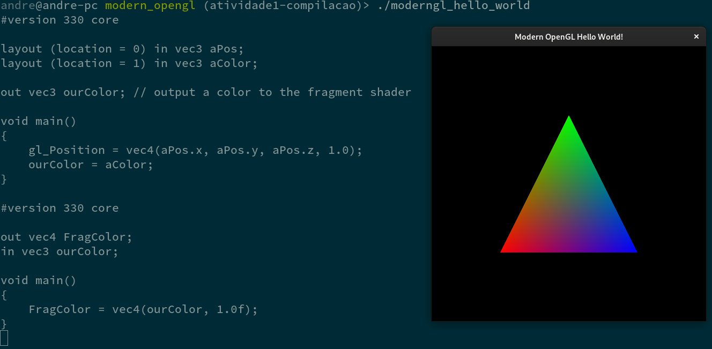

# Primeira Atividade - Compilação

A primeira atividade da disciplina consiste em configurar o ambiente e compilar a aplicação OpenGL.

### Instalando o OpenGL
Ao executar o comando `make`, obteve-se o seguinte erro:

<pre>
$ make
gcc -Wall -Wextra -Wpedantic -std=c99 -O0 -g3 main.c -lglut -lGLU -lGL -o moderngl_hello_world
In file included from <b>main.c:13</b>:
<b>main.h:4:10:</b> <b>fatal error: </b>GL/glut.h: No such file or directory
    4 | #include <b>&lt;GL/glut.h&gt;</b>
      |          <b>^~~~~~~~~~~</b>
compilation terminated.
make: *** [Makefile:4: all] Error 1
</pre>

Que indica a falta da biblioteca GLUT no sistema. Seguindo [este tutorial](http://www.newfreesoft.com/linux/install_opengl_development_environment_in_fedora_and_ubuntu_780/),
a biblioteca foi instalada através do pacote `freeglut-devel` no fedora.

### Executando
Com as bibliotecas necessárias instaladas, o programa compilou e executou conforme o esperado.

